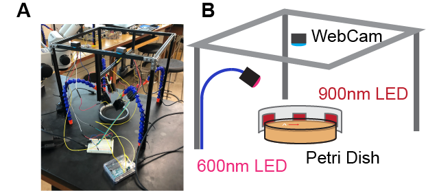

This folder contains a summary of the 2019 IBRO maker's school held as a part of the IBRO Neuroscience School at McGill University in Montreal, Quebec Canada.

We took in 7 students, split them up into three groups and over the course of 5 days taught them to build and program the apparatus shown in Figure 1.

 

Larvae obtained from Dr. Ohyama's lab bearing the red-shifted channelrhodopsin Chrimson in either appetitive, aversive, or motor command neurons were placed on an agar plate, filmed with a webcam, position tracked and simultaneously fed into a microcontroller which altered LED intensity. Software to drive this closed-loop behavioral system was written from scratch by IBRO students under the supervision of Drs Krishnaswamy and Hendricks. Students used this system to ask whether we could recapitulate common larval behaviors such as tracking the source of an appetitive odor; in this case, LED intensity was ramped up or down according to the position of a larvae in a 'virtual' gradient.

Briefly, students had to use construction rail from MakerBeam to build a rectangular frame which housed a web camera and four far-red LEDs; the webcam was modified such that it could only view objects under infrared (>800nm) wavelengths. Four high-intensity, 560nm LEDs were affixed to the legs of the behavioral arena, wired to constant-current LED drivers (BuckPuck 1000mAh) which were in turn wired to an Arduino Microcontroller. Students learned how to wire these LEDs and connect them to microcontrollers from scratch.

 To image from the webcam, segment the image, derive live centroid positions for maggots, and send analog control signals to LED drivers, students were taught to use the python-based graphical programming environment Bonsai. Summary code from the three groups is available for download as are wiring diagrams for LEDs-Buckpucks-arduinos (Figure 2). A bill of goods is also available and shows that construction of a single arena is approximately $100 CDN. 
  
Sample Bonsai Code from each of the 3 groups is provided under the corresponding folder.

Instructors: Drs. Arjun krishnaswamy, Michael Hendricks, Tomoko Ohyama
TAs: Kim Gruver 
